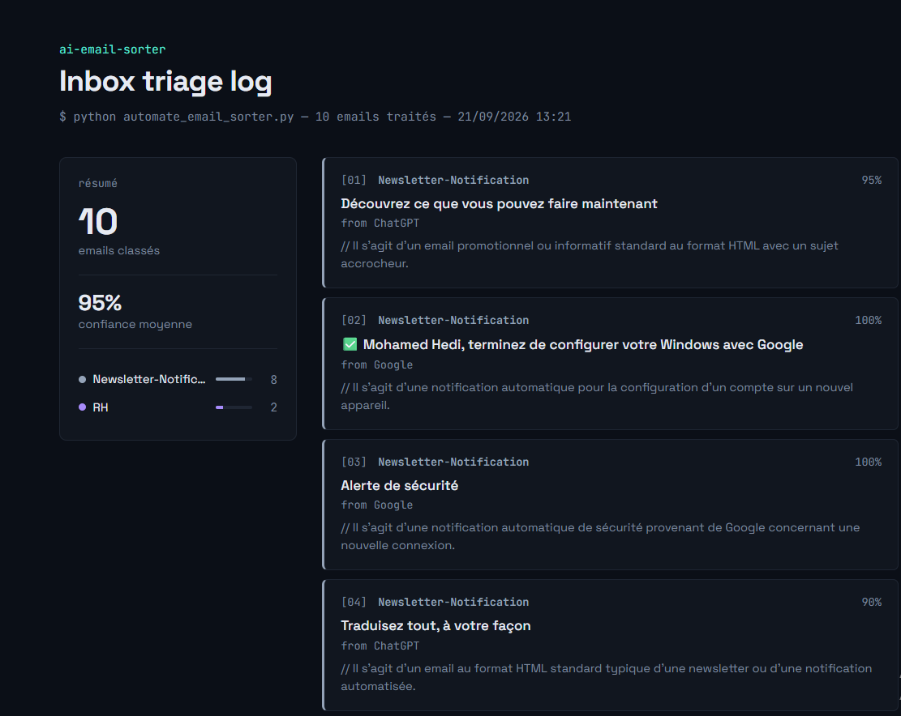

# AI Email Sorter

Un outil qui classe automatiquement les emails d'une boîte Gmail par catégorie (Facture, Support, RH, Spam, Commercial, Newsletter) et applique le label correspondant — sans intervention manuelle.



## Le projet en bref

Ce projet automatise le tri d'une boîte mail en combinant :
- **Gmail API** pour lire et étiqueter les emails
- **Intelligence Artificielle** pour comprendre le contenu et décider de la catégorie
- Un **rapport visuel** généré automatiquement après chaque exécution

## Deux approches testées (et pourquoi la seconde a gagné)

Ce projet documente volontairement les deux approches essayées, parce que le raisonnement derrière le choix final est aussi important que le résultat.

### Approche 1 — Classification ML classique (Naive Bayes + TF-IDF)

Un modèle entraîné from scratch sur un jeu de données de 100 exemples d'emails en français, avec `scikit-learn`.

**Résultat sur les données de test** : ~80% de précision.

**Résultat sur de vrais emails Gmail** : quasi aléatoire (confiance de 20-28%, proche du hasard pour 5 catégories).

**Pourquoi ça n'a pas marché en production :**
- Les emails réels étaient en anglais, le modèle entraîné uniquement en français
- Le vocabulaire des emails réels (newsletters, notifications de comptes) ne correspondait à aucune des catégories d'entraînement
- 100 exemples restent insuffisants pour généraliser correctement en NLP classique

Le code de cette approche est conservé dans `train_classifier.py` et `training_data.csv`, à titre de démonstration et de comparaison.

### Approche 2 — Classification via LLM (Gemini API)

Remplacement du modèle entraîné par un appel à l'API Gemini avec un prompt décrivant les catégories.

**Résultat sur les mêmes emails réels** : confiance de 85% à 100%, classifications cohérentes, aucune donnée d'entraînement nécessaire.

**Pourquoi ça marche mieux ici :**
- Comprend le contexte sémantique, pas seulement des motifs statistiques de mots
- Fonctionne nativement dans n'importe quelle langue
- S'adapte instantanément si on ajoute ou modifie une catégorie (juste changer le prompt, pas besoin de ré-entraîner)

**Compromis à noter** : dépendance à une API externe (coût, latence, disponibilité) — un choix d'architecture différent, pas gratuit indéfiniment.

## Fonctionnement

```
Gmail (API) → Récupération des emails
     ↓
Gemini (API) → Classification par catégorie + niveau de confiance
     ↓
Gmail (API) → Application automatique du label correspondant
     ↓
Rapport HTML → Visualisation des résultats
```

## Stack technique

- **Python 3.14**
- **Gmail API** (`google-api-python-client`, OAuth2) — lecture et modification des emails
- **Gemini API** (`google-genai`) — classification par LLM
- **scikit-learn / pandas** — approche ML classique (comparaison)
- **HTML/CSS/JS** généré dynamiquement — rapport visuel

## Installation

### 1. Cloner le repo

```bash
git clone https://github.com/briguihedi/ai-email-sorter.git
cd ai-email-sorter
```

### 2. Installer les dépendances

```bash
pip install google-auth-oauthlib google-auth-httplib2 google-api-python-client scikit-learn pandas google-genai python-dotenv
```

### 3. Configurer l'accès Gmail

- Créer un projet sur [Google Cloud Console](https://console.cloud.google.com)
- Activer la Gmail API
- Créer des identifiants OAuth (type "Desktop app")
- Télécharger le fichier JSON et le renommer `credentials.json` à la racine du projet

### 4. Configurer la clé Gemini

- Obtenir une clé gratuite sur [Google AI Studio](https://aistudio.google.com)
- Créer un fichier `.env` à la racine :

```
GEMINI_API_KEY=ta_cle_ici
```

### 5. Lancer

```bash
python automate_email_sorter.py
```

Un rapport HTML s'ouvre automatiquement dans le navigateur à la fin de l'exécution, et les labels `AI-Sorted/...` apparaissent dans Gmail.

## Structure du projet

```
├── fetch_emails.py           # Connexion Gmail + récupération des emails + gestion des labels
├── classify_with_gemini.py   # Classification LLM (version standalone, sans automatisation des labels)
├── automate_email_sorter.py  # Script principal : fetch + classify + label + rapport
├── report_generator.py       # Génération du rapport HTML visuel
├── train_classifier.py       # Approche ML classique (comparaison)
├── training_data.csv         # Jeu de données pour l'approche ML classique
└── .gitignore                # Exclut credentials.json, token.json, .env, *.pkl
```

## Sécurité

`credentials.json`, `token.json` et `.env` contiennent des informations sensibles et sont exclus du repo via `.gitignore`. La permission Gmail demandée est `gmail.modify` (lecture + labels), pas de suppression définitive d'emails.

## Auteur

Mohamed Hedi Brigui — Master Data Science, ISIMM (Institut Supérieur d'Informatique et de Mathématiques de Monastir)
[LinkedIn](https://www.linkedin.com/in/mohamed-hedi-brigui-67680736a/)
